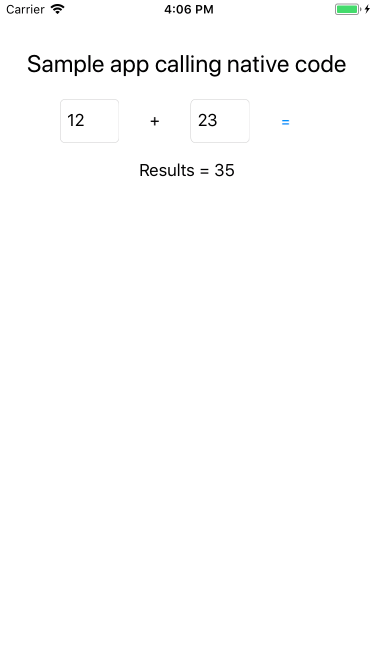
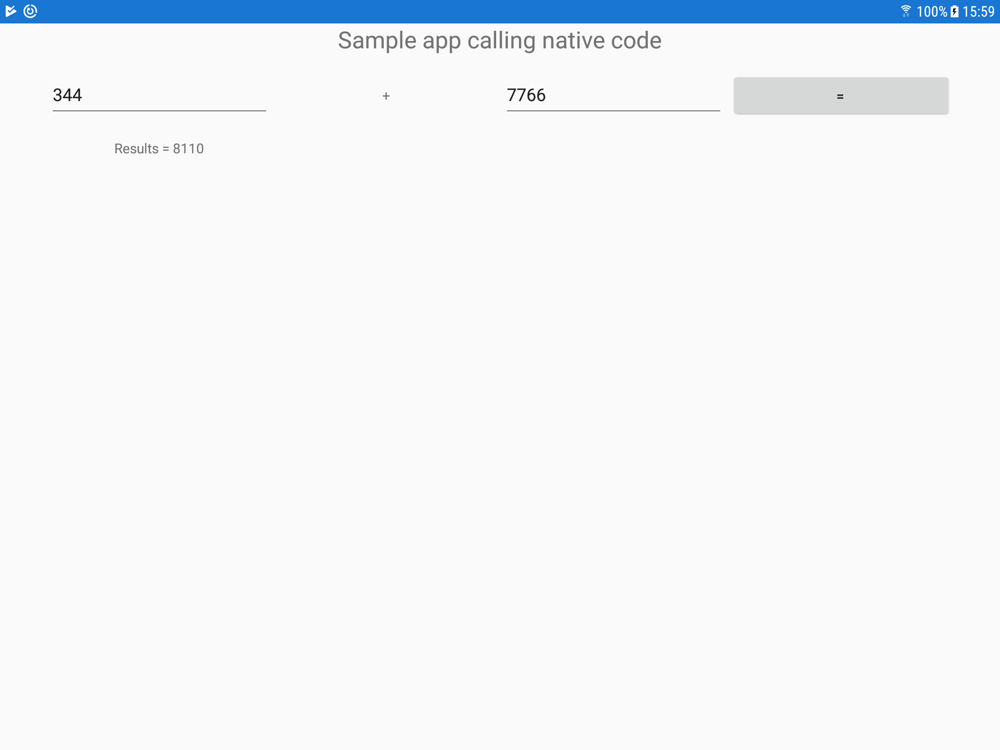

# Xamarin app running native code

## Get started

1. Setup your Xamarin dev env : https://www.xamarin.com/forms

2. Open the project

3. Run

## How it's done ?

Native code call is done via a `DependencyService` that's implemented in each subproject (iOS -> `Sample_iOS.cs`, Android -> `Sample_Android.cs`) in the specific implementation the code use a `DllImport` to load the specific library `.so` for android, `.a` for iOS.

*NB Android ABI is sniffed from the parent folder of the `.so`*

*NB iOS use the following compilation flag to enable the building (`ios project -> options -> mtouch args`)*

    -cxx -gcc_flags  "-L${ProjectDir} -lMyLibiOS -force_load ${ProjectDir}/libMyLibiOS.a"

## To build the library

Android : in `lib/android` run `build_plugin.sh`

iOS : in `lib/iOS/MyLib` run `make` 

## Troobleshooting Android

1. If will running you get this kind of errors : 

    [Mono] DllImport unable to load library 'dlopen failed: library "/data/app/com.smartorigin.samples.xamarinSample-1/lib/arm64/libnative" not found'.

    This results in a `DLLNotFoundException` in your code.

    This means that the android app can't find the .so you provide. 

    You can `unzip` de generated apk located in bin. To see if your `.so` is here.
    
    What you can do is rebuild the `.so` for the missing abi.

    Add it in the correct libs folder set de .so file to you android `.csproj`

        <AndroidNativeLibrary Include="lib\armeabi-v7a\libnative.so"> <CopyToOutputDirectory>Always</CopyToOutputDirectory>
       <Abi>armeabi-v7a</Abi>
       </AndroidNativeLibrary>

## Help

iOS

- https://developer.xamarin.com/guides/ios/advanced_topics/native_interop/#Linking_Your_Library

- https://github.com/viniciusjarina/NativeBindingVS

Android

- https://richzwaap.wordpress.com/2014/08/07/pinvoke-with-xamarin-and-android/

- https://code.tutsplus.com/tutorials/accessing-native-features-with-xamarinforms--cms-22103

- https://forums.xamarin.com/discussion/comment/14184#Comment_14184

- https://kerry.lothrop.de/c-libraries/

- https://developer.xamarin.com/guides/android/advanced_topics/using_native_libraries/

- https://developer.android.com/ndk/guides/abis.html

## Screenshots

iOS

Android
